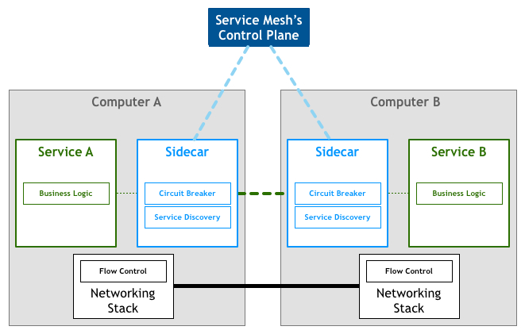

## Istio

### Istio简介

#### 服务网格

> 服务网格(ServiceMesh)是致力于解决服务间通讯的基础设施层。它负责在现代云原生应用程序和复杂服务拓扑来可靠传递请求。Service Mesh通过一组轻量级网络代理(Sidecar proxy)与应用程序代码部署在一起来实现，而无需感知应用程序本身

ServiceMesh有如下特点:
- 应用程序间通讯的中间层
- 轻量级网络代理
- 应用程序无感知
- 解耦应用程序的重试/超时、监控、追踪和服务发现

ServiceMesh的架构图如下所示:

#### Istio

Istio是由Google、IBM、Lyft开源的微服务管理、保护和监控框架。它是一个开源的服务网关(Service Mesh)的实现

使用Istio可以很简单的创建具有负载均衡、服务间认证、监控等功能的服务网格，而不需要对服务的代码进行任何修改(无代码入侵)。

Istio特性:
- 流量管理：控制服务间的流量和API调用流，使调用更可靠，增强不同环境下的网络鲁棒性(让服务更加健壮)
- 可观测性: 了解服务之间的依赖关系和它们之间的性质和流量，提供快速识别定位问题的能力
- 策略实施: 通过配置mesh而不是改变代码的方式来控制服务之间的访问策略
- 服务识别和安全: 提供在mesh里的服务可识别性和安全性保护。

架构图如下:

istio是ServiceMesh的实现，整个架构分为控制层和数据层:
- 数据层: 由一组智能代理（Envoy）作为sidecar部署，协调和控制所有microservices之间的网络通信
- 控制层: 负责管理和配置代理路由流量，以及在运行时执行的政策

##### Envoy

Istio使用Envoy代理的扩展版本，该代理是以C++开发的高性能代理，用于调解service mesh中所有服务的所有入站和出站流量。 

提供的功能如下:
- 动态服务发现
- 负载均衡
- TLS 终止
- HTTP/2 & gRPC 代理
- 熔断器
- 健康检查、基于百分比流量拆分的灰度发布
- 故障注入
- 丰富的度量指标

Envoy 被部署为 sidecar，和对应服务在同一个 Kubernetes pod 中。这允许 Istio 将大量关于流量行为的信号作为属性提取出来，而这些属性又可以在 Mixer 中用于执行策略决策，并发送给监控系统，以提供整个网格行为的信息。

##### Mixer

Mixer负责在service mesh上执行访问控制和使用策略，并收集Envoy代理和其他服务的遥测数据。代理提取请求级属性，发送到mixer进行评估。

##### Pilot

Pilot 为 Envoy sidecar 提供服务发现功能，为智能路由（例如 A/B 测试、金丝雀部署等）和弹性（超时、重试、熔断器等）提供流量管理功能。它将控制流量行为的高级路由规则转换为特定于 Envoy 的配置，并在运行时将它们传播到 sidecar。

Pilot 将平台特定的服务发现机制抽象化并将其合成为符合 Envoy 数据平面 API 的任何 sidecar 都可以使用的标准格式。这种松散耦合使得 Istio 能够在多种环境下运行（例如，Kubernetes、Consul、Nomad），同时保持用于流量管理的相同操作界面。。

##### Citadel

Citadel 通过内置身份和凭证管理可以提供强大的服务间和最终用户身份验证。可用于升级服务网格中未加密的流量，并为运维人员提供基于服务标识而不是网络控制的强制执行策略的能力。

Citadel提供基于角色的访问控制(RBAC)，以控制服务的访问

### 参考资料
- [Service Mesh领袖 - Istio实践](https://gitbook.cn/books/5b9624e91b47b6455d257173/index.html)
- [初识Istio](https://www.hi-linux.com/posts/28535.html)
- [Istio中文网](https://istio.io/zh/docs/concepts/what-is-istio/)
- [什么是ServiceMesh](https://jimmysong.io/posts/what-is-a-service-mesh/)