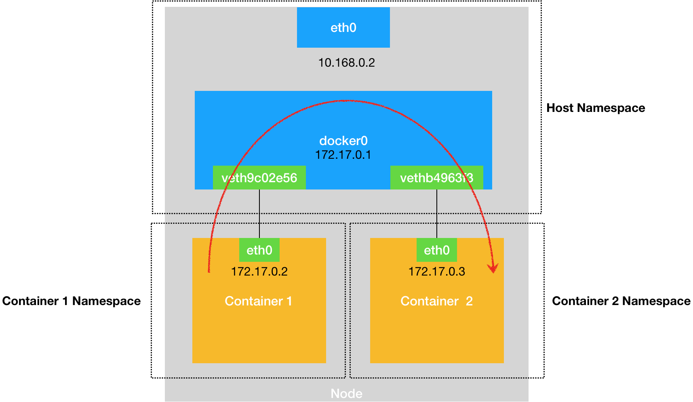
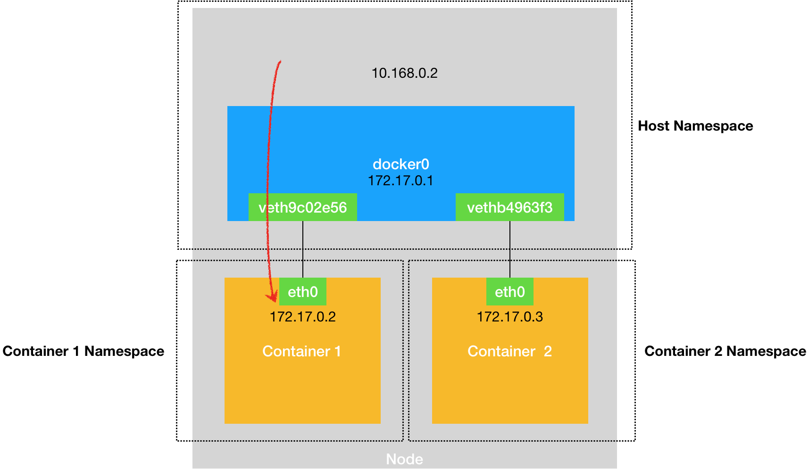
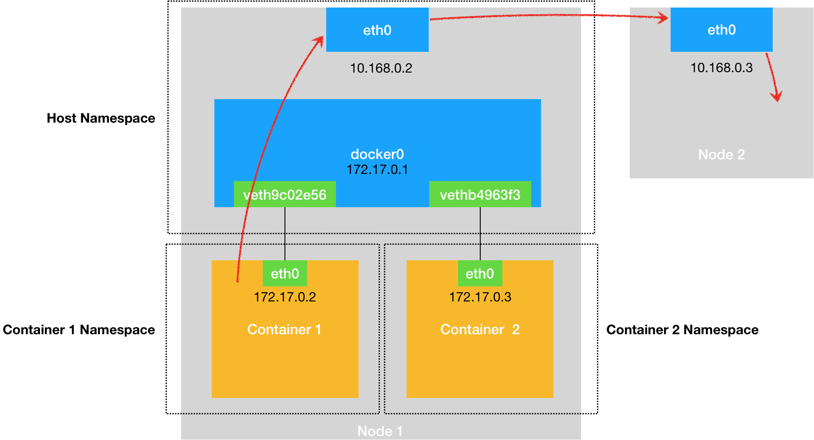

## 容器网络

容器所能看见的网络栈，是被隔离在它自己的 Network Namespace中的。网络栈包括了：网卡(Network Interface)、回环设备(Loopback Device)、路由表(Routing Table)和 iptables 规则。

### 容器进程之间的通信

容器既然是被隔离在自己的 Network Namespace中，那么怎么和其他 Network Namespace通信。

如果把容器看成一台主机，主机之间要通信， 需要用网线把它们连在一台交换机上。在Linux中实现交换作用的设备就是网桥(Bridge)。它是一个工作在数据链路层的设备，主要功能是根据MAC地址学习来将数据包转发到网桥不同端口上。

Docker会默认在宿主机上创建一个名为docker0的网桥，这样连接在docker0上的容器就可以用它来进行通信。

容器连接到docker0上，依靠的是一种叫`Veth Pair`的虚拟设备。

#### Veth pair

Veth Pair被创建出来后，总是以两张虚拟网卡(Veth Peer)的形式成对出现。并且其中一张"网卡"发出的数据包，可以直接出现在与它对应的另一张网卡上，哪怕这两个网卡在不同的Network Namespace中。

这样Veth Pair常常就用作连接不同Network Namespace的"网线"

比如现在启动一个nginx容器，并进入容器中查看它的网络设备:
``` 
docker run –d --name nginx-1 nginx


# 在宿主机上
$ docker exec -it nginx-1 /bin/bash
# 在容器里
root@2b3c181aecf1:/# ifconfig
eth0: flags=4163<UP,BROADCAST,RUNNING,MULTICAST>  mtu 1500
        inet 172.17.0.2  netmask 255.255.0.0  broadcast 0.0.0.0
        inet6 fe80::42:acff:fe11:2  prefixlen 64  scopeid 0x20<link>
        ether 02:42:ac:11:00:02  txqueuelen 0  (Ethernet)
        RX packets 364  bytes 8137175 (7.7 MiB)
        RX errors 0  dropped 0  overruns 0  frame 0
        TX packets 281  bytes 21161 (20.6 KiB)
        TX errors 0  dropped 0 overruns 0  carrier 0  collisions 0
        
lo: flags=73<UP,LOOPBACK,RUNNING>  mtu 65536
        inet 127.0.0.1  netmask 255.0.0.0
        inet6 ::1  prefixlen 128  scopeid 0x10<host>
        loop  txqueuelen 1000  (Local Loopback)
        RX packets 0  bytes 0 (0.0 B)
        RX errors 0  dropped 0  overruns 0  frame 0
        TX packets 0  bytes 0 (0.0 B)
        TX errors 0  dropped 0 overruns 0  carrier 0  collisions 0
        
$ route
Kernel IP routing table
Destination     Gateway         Genmask         Flags Metric Ref    Use Iface
default         172.17.0.1      0.0.0.0         UG    0      0        0 eth0
172.17.0.0      0.0.0.0         255.255.0.0     U     0      0        0 eth0
```
可以看到，这个容器中有一个叫作eth0的网卡，它正是一个Veth Pair设备在容器里的一端。通过 route 命令可以看到，eth0网卡正是容器里的默认路由设备，所有172.17.0.0/16网段的请求也会交给docker0处理(第二条路由规则)

在Veth Pair设备的另一端在宿主机上，是一张名字类似 veth9c02e56 的网卡， 通过brctl(如果没有则安装yum install bridge-utils)，可以看到这张网卡被"插"在docker0上
``` 
$ docker run –d --name nginx-2 nginx
$ brctl show
bridge name bridge id  STP enabled interfaces
docker0  8000.0242d8e4dfc1 no  veth9c02e56
```

如果在宿主机上在启动一个容器nginx-2，可以看到一张新的 vethxxxx 的网卡也被"插"在docker0 网桥上

#### Veth Pair原理

当在nginx-2 容器中访问 nginx-1 的时候(如ping 172.17.0.3)，这个时候会触发第二条路由规则。这条规则的gateway是 0.0.0
.0，意味着通过这条规则的IP包应该通过本机的eth0网卡(直连网络设备)，通过二层网络直接发往目的主机。如果直连到达 nginx-2 容器，就需要nginx-2的MAC地址， eth0会发送一个ARP广播，通过IP查找对应的MAC地址。

eth0是Veth Pair的一端，所有的docker容器的Veth Pair的另一端都插在eth0上，docker0会把ARP广播到所有的其他插在docker0上的虚拟网卡上，这样同样插在docker0上的，nginx2的网络协议栈就会收到这个ARP请求，把172.17.0.3的MAC地址回复给nginx-1。

docker0在这个过程中扮演着一个二层交换机的功能，流程如下:


这样，被限制在Network Namespace的容器进程，通过 Veth Pair + 宿主机网桥的方式，实现了与其他容器的数据交换

##### 宿主机内访问容器

同样的，如果在宿主机上访问容器IP，这个请求数据包也是先到达docker0网桥，然后被转发到对应的Veth Pair设备上，最后到达容器内



##### 容器访问宿主机

类似的，当容器试图连接另一个宿主机时(ping 10.168.0.3)， 它发出的请求首先经过docker0网桥出现在宿主机上，然后根据宿主机的路由表的直连规则，将访问请求转发给宿主机的eth0处理。然后由宿主机的eth0网卡转发给宿主机网络



当遇到容器连接不通外网时， 首先试试docker0网桥能不能ping通， 然后查看跟docker0和Veth Pair 设备相关的 iptables是不是异常。


### 容器跨主机网络

如果要访问另一台宿主机上的docker容器，就涉及到跨主机通信的问题。

在Docker的默认配置下，一台宿主机上的docker0网桥和其他宿主机上的docker0网桥是没有任何关联，所以它们之间是没办法相互联通的， 但是如果通过软件的方式创建一个"公用"的网桥，把集群内所有容器连接到这个网桥上就可以了，这样整个集群的网络类似如下:


#### Flannel项目提供的容器网络方案

Flannel项目是 CoreOS 公司主推的网络方案，提供了三种后端实现：
1. VXLAN
2. host-gw
3. UDP

#### Flannel UDP模式
假如有两天宿主机：
- Node1上有container-1， Ip地址是 100.96.1.2，对应的docker0网桥的地址是: 100.96.1.1/24
- Node2上有container-2， Ip地址是100.96.2.3, 对应的docker0网桥是: 100.96.2.1/24

(1)如果container1访问container2， container1里进程发起的IP包，源地址是 100.96.1.2 目的地址是100.96.2
.3。显然目的地址不在Node1的docker0网桥网段里，所以这个IP包会通过默认路由规则出现在宿主机上。

(2) 这个IP包的下一个目的地，取决于宿主机的路由规则，此时Fannel在宿主机上创建了一些路由规则，以Node1为例:
``` 
# 在 Node 1 上
$ ip route
default via 10.168.0.1 dev eth0
100.96.0.0/16 dev flannel0  proto kernel  scope link  src 100.96.1.0
100.96.1.0/24 dev docker0  proto kernel  scope link  src 100.96.1.1
10.168.0.0/24 dev eth0  proto kernel  scope link  src 10.168.0.2
```
这样IP包就会匹配 100.96.0.0/16 这条规则，进入一个叫做 flannel0的设备中。flannel0是一个 TUN设备(Tunnel设备)

(3) IP包进入flannel0设备后，宿主机上的Flannel进程就会收到这个IP包，然后根据这个IP包的地址 100.96.2.3转发给Node2宿主机(根据子网)的Flannel进程

(4) Node2的Flannel进程收到IP包后，就将IP包发送给它管理的flannel0，根据TUN原理，这个IP包就会流入本机的路由表(内核网络栈)

(5) Node2的路由表，也跟Node1类似生成了一些路由规则，然后根据这些路由规则，将IP包转给docker0网桥。接下来就和主机内容器通信流程一样了


整个流程如下:


Flannel UDP模式实际上是一个三层的 OverLay 网络，它首先对发出端的IP包进行UDP封装，然后在接收端解封拿到原始的IP包， 然后把IP包转发给目标容器，就好像在不同的宿主机之间打开了一条隧道， 让容器可以直接用IP地址通信，不用关心容器和宿主机的分布情况
##### TUN设备
TUN设备是一种工作在三层(网络层)的虚拟网络设备，它的功能是在操作系统内核和用户应用程序之间传递IP包。

以flannel0设备为例:
当操作系统把一个IP包发送给flannel0设备后，flannel0就会把这个IP包交给创建这个设备的应用程序，即Flannel进程。这是从内核态到用户态的流动方向

反之，如果Flannel进程想flannel0发送一个IP包，那么这个IP包就会出现在宿主机网络栈中，然后根据宿主机路由表进行下一步处理。这是一个用户态向内核态的流动方向。

##### Flannel子网

在Flannel管理的网络容器中，一台宿主机上所有容器，都属于该宿主机被分配的一个"子网",比如Node1的子网是100.96.1.0，Node2的子网是100.96.2.0。

这样Flannel进程处理有flannel0传入的ip包时，就可以根据目的IP的地址匹配到对应的子网(100.96.2.3就会匹配到100.96.2.0)，然后就可以从配置中心(Etcd)找到这个子网所对应的宿主机地址

#### Flannel VXLAN模式

由于UDP模式存在三次用户态和内核态之间的转换，性能比较差，Flannel VXLAN模式进行了优化。

VXLAN， Virtual Extensible LAN(虚拟可扩展局域网)，是Linux内核本身就支持的一种网络虚拟化技术， 所以VXLAN可以在内核态实现UDP模式的封装和解封，构建出与UDP模式相似的隧道，构建出 Overlay Network(覆盖网络)

VXLAN的覆盖网络的设计思想是:在现有的三层网络之上，覆盖一层虚拟的、由内核VXLAN模块负责维护的二层网络(数据链路层)，使得连接在这个VXLAN二层网络上的主机(虚拟机或容器)可以像在同一个局域网里那样自由通信。

为了在二层网络上打通隧道，VXLAN宿主机上设置一个特殊的网络设备作为隧道的两端，这个设备叫VTEP(Virtual Tunnel End Point 虚拟隧道端点)。VTEP的作用和fluentd进程作用相似，不过它的封装和解封都在内核里完成，所以相较于UDP模式性能会更好，也是目前主流的方案

##### VXLAN流程


每台宿主机上的都有个一个叫flannel.1的设备，就是VXLAN所需的VTEP设备，它既有IP地址也有MAC地址

上图container1的IP地址是10.1.15.2，要访问Container2的IP10.1.16.3

(1) container1发出请求后，目的地址是10.1.16.3的IP包首先会出现在docker0网桥上，然后被本机的flannel.1处理。

(2) 源VTEP设备(Node1)收到原始IP包后，需要想办法加上MAC地址，封装成一个二层的数据帧，发送给目的VTEP(Node2)

(3) flanneld生成的路由规则可以知道目的VTEP设备的IP地址，根据ARP协议可以得到目的VTEP的MAC地址，就可以封装成一个二层的网络帧如下:

这个封装出来的二层数据帧叫做内部数据帧(Inner Ethernet Frame)，Linux内核会进一步封装，将这个内部数据帧封装成一个普通的数据帧，让他可以载着内部数据帧通过宿主机的eth0进行传输，这次封装出来的叫外部数据帧(Outer Enthernet Frame)

(4) linux会把这个外部数据帧封装成一个UDP包发出去，但是这里只知道目的VTEP的MAC地址，并不知道目的宿主机的MAC地址，这里就是flannel.1内部维护的一个转发数据库，可以通过目的VTEP的MAC地址查出目的主机的IP地址。所以查出目的主机的IP就会进行一个正常的数据包的封装

最后会封装出的外部数据帧的格式如下:


(5) 接着目的宿主机就会拆包，然后发给目的宿主机的flannel.1设备进行解封，发给宿主机上的网络
### 附录
- [Linux route指令 路由表](https://blog.csdn.net/vevenlcf/article/details/48026965)